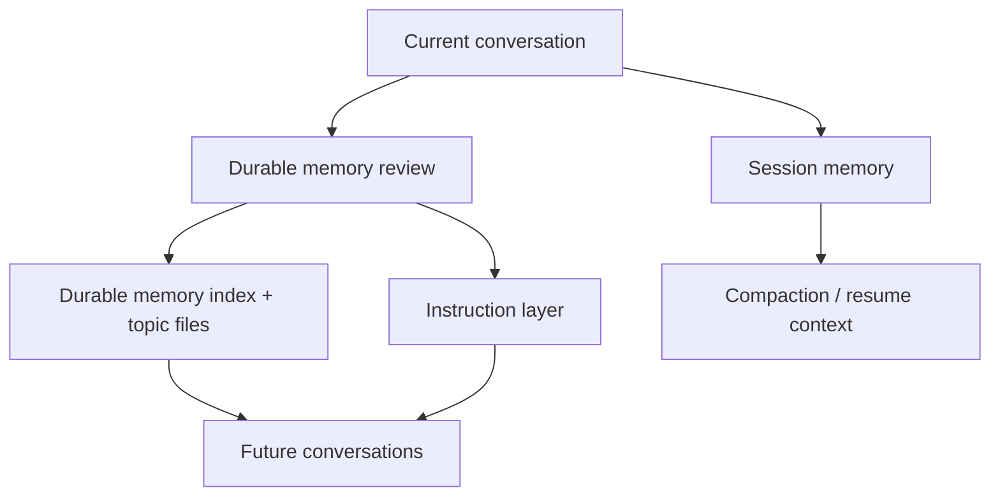

# Layered Memory Skill

An open-source, clean-room skill for running a layered memory workflow in coding agents.

It gives an agent three distinct memory lanes:

1. Instruction memory for durable rules
2. Session memory for the current workstream
3. Durable memory for facts worth carrying across conversations

The goal is simple: keep the main prompt lean, preserve the right context, and avoid turning every conversation into a total reset.

## Why this exists

Most coding agents have two failure modes:

- They forget important context between sessions
- They stuff too much transient detail into persistent memory

This skill separates memory by job:

- The instruction layer holds stable rules and collaboration preferences
- The session layer tracks the current task state, files, commands, and mistakes
- The durable layer stores only non-derivable facts that are still useful later

That makes memory easier to maintain, safer to trust, and cheaper to keep in prompt context.

## What is included

- A reusable `SKILL.md`
- A durable memory taxonomy
- A session-summary workflow
- A memory review and promotion workflow
- Example files you can copy into your own setup

## Memory model



### 1. Instruction layer

This is where stable rules belong:

- project conventions
- collaboration preferences
- approval boundaries
- testing and release expectations

Map this layer to whatever your host tool already uses:

- `CLAUDE.md`
- `AGENTS.md`
- `.github/copilot-instructions.md`
- project-level system prompt files

### 2. Session layer

This is the working notebook for the current thread:

- current state
- task specification
- important files and functions
- commands that matter
- errors and corrections
- terse worklog

It is short-lived and should be optimized for continuity, not permanence.

### 3. Durable memory layer

This is the long-term memory directory. It stores things that are not obvious from the repo itself and are still useful later.

This skill uses four durable memory types:

- `user-profile`
- `working-style`
- `project-context`
- `external-reference`

## Install

### As a Codex skill

Clone this repo into your skills directory:

```bash
git clone <your-repo-url> ~/.codex/skills/layered-memory-skill
```

Or symlink it while developing:

```bash
ln -s /path/to/layered-memory-skill ~/.codex/skills/layered-memory-skill
```

### As a prompt pattern for other agents

If your agent platform does not support native skills, copy the workflow from:

- [SKILL.md](./SKILL.md)
- [references/architecture.md](./references/architecture.md)
- [references/host-tool-mapping.md](./references/host-tool-mapping.md)

Then adapt the file paths to your agent runtime.

## Suggested file layout

```text
.agent-memory/
├── MEMORY.md
├── user/
├── style/
├── project/
├── references/
└── session/
    └── summary.md
```

`MEMORY.md` should stay lightweight. Use it as an index that points to topic files rather than a dumping ground.

## Promotion rules

Promote something into the instruction layer only when it is:

- stable
- normative
- broadly applicable
- likely to be wrong if the agent has to rediscover it every time

Keep something in durable memory when it is:

- true but not derivable from the code
- useful in future sessions
- not yet stable enough to become an instruction

Keep something only in session memory when it is:

- specific to the current task
- likely to expire soon
- only useful for resuming the present thread

## Examples

- Durable index: [examples/persistent-memory/MEMORY.md](./examples/persistent-memory/MEMORY.md)
- Durable user memory: [examples/persistent-memory/user-profile.md](./examples/persistent-memory/user-profile.md)
- Durable style memory: [examples/persistent-memory/testing-policy.md](./examples/persistent-memory/testing-policy.md)
- Session summary: [examples/session-memory/summary.md](./examples/session-memory/summary.md)

## Clean-room note

This repository is an original implementation of a layered memory workflow. It does not reproduce proprietary prompt text. It is designed to capture the general pattern that modern coding agents use: separate rules, working memory, and long-lived memory so each layer stays useful.

If you came here looking for the memory ideas discussed around Claude Code, this repo is the safe, reusable, open version of that pattern rather than a prompt dump.

## FAQ

### Is this a copy of Claude Code's internal prompt?

No. This is a clean-room skill and repo design that captures the layered memory idea without reproducing proprietary prompt text.

### Why not keep everything in one big instruction file?

Because rules, active task state, and long-lived facts decay at different speeds. Mixing them makes the agent noisier and harder to trust.

### Can I adapt this to a different agent stack?

Yes. The core pattern is portable. Only the instruction-file mapping changes.
